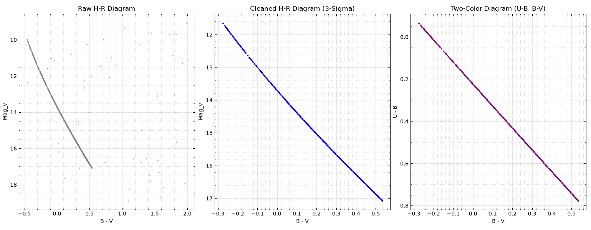

# Synthetic Star Cluster Generation & Photometric Reduction Pipeline

## Overview
This repository contains a modular Python-based pipeline designed to simulate optical observations of synthetic star clusters and perform statistical data reduction. It combines theoretical astrophysics (Planck's Law, Radiative Transfer, Initial Mass Function) with real-world observational constraints (CCD noise mechanisms, atmospheric seeing, field star contamination).

The goal of this repository is to generate raw observational data and clean the Main Sequence on the Hertzsprung-Russell (H-R) diagram using an iterative 3-sigma polynomial clipping algorithm, simulating a complete photometric data reduction process.

## Core Features
* **Astrophysical Engine:** Generates cluster members using a standard Initial Mass Function (IMF) and calculates theoretical U, B, and V band fluxes via the Planck function and exact solid angle (omega) geometry.
* **Observational Noise Modeling:** Simulates realistic telescope and CCD conditions. It injects variance based on:
- System Throughput (Optical efficiency)
- Atmospheric Seeing (FWHM)
- Sky Background & Dark Current rates
- Poisson/Shot Noise for photon counts and Readout Noise
* **Data Reduction:** Applies iterative polynomial fitting to the B-V color index to statistically filter out field stars.
* **Dynamic Command Line:** Fully adjustable parameters via command line arguments for cluster density and contamination levels.

## Project Structure
The project has the following modules:
- `constants.py`: Contains all physical constants, telescope parameters, and CCD specifications.
- `simulator.py`: The simulation engine. Handles the flux calculations, applies noise models, and injects random field stars.
- `main.py`: The data analysis and reduction pipeline. Includes the command line implementation, executes the 3-sigma clipping mask, logs the reduction efficiency, and plots the 3-panel photometric diagnostic diagrams.

### Example Terminal Output
- Number of cluster stars: 1000
- Number of expected field stars: 50
- Detected Field Stars: 50
- Cleared Field Stars: 50
- Remaining Field Stars: 0
- Efficiency: %100.00

### Example Diagrams


## Installation
```bash
pip install -r requirements.txt
```

## Usage
```bash
python main.py --n_stars 1000 --field 50 --seed 4
```

**Arguments**
| Argument    | Default | Description                      |
| `--n_stars` | 1000    | Total number of cluster members  |
| `--field`   | 50      | Expected number of field stars   |
| `--seed`    | 4       | Seed for reproducible generation |
